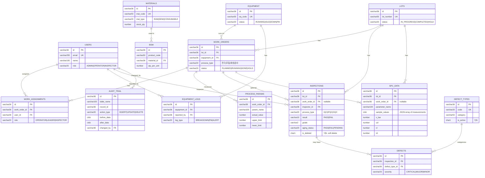

# DB 스키마 문서

`battery-mes-backend/src/main/resources/db/schema-oracle.sql` 기준으로 작성되었습니다 (Oracle, 총 14개 테이블).

## ERD

## 테이블 명세

### users — 사용자 계정
| 컬럼 | 타입 | 제약 | 설명 |
|---|---|---|---|
| id | VARCHAR2(36) | PK | UUID |
| email | VARCHAR2(255) | NOT NULL, UNIQUE | 로그인 이메일 |
| password | VARCHAR2(255) | NOT NULL | 해시된 비밀번호 |
| name | VARCHAR2(100) | NOT NULL | 사용자명 |
| role | VARCHAR2(20) | NOT NULL, CHECK | `ADMIN` / `OPERATOR` / `INSPECTOR` |
| created_at / updated_at | TIMESTAMP | NOT NULL | |

### equipment — 설비
| 컬럼 | 타입 | 제약 | 설명 |
|---|---|---|---|
| id | VARCHAR2(36) | PK | |
| eq_code | VARCHAR2(50) | NOT NULL, UNIQUE | 설비 코드 |
| eq_name | VARCHAR2(200) | NOT NULL | |
| eq_type | VARCHAR2(50) | NOT NULL | |
| status | VARCHAR2(20) | NOT NULL, CHECK | `RUNNING` / `IDLE` / `DOWN` / `PM` |
| last_pm_at | TIMESTAMP | | 최근 예방정비 시각 |

### materials — 자재
| 컬럼 | 타입 | 제약 | 설명 |
|---|---|---|---|
| id | VARCHAR2(36) | PK | |
| mat_code | VARCHAR2(50) | NOT NULL, UNIQUE | |
| mat_name | VARCHAR2(200) | NOT NULL | |
| mat_type | VARCHAR2(20) | NOT NULL, CHECK | `RAW` / `SEMI` / `CONSUMABLE` |
| stock_qty | NUMBER(15,4) | NOT NULL | 재고 수량 |
| unit | VARCHAR2(20) | NOT NULL | |

### lots — LOT(생산 배치)
| 컬럼 | 타입 | 제약 | 설명 |
|---|---|---|---|
| id | VARCHAR2(36) | PK | |
| lot_number | VARCHAR2(50) | NOT NULL, UNIQUE | |
| product_name | VARCHAR2(200) | NOT NULL | |
| quantity | NUMBER(10) | NOT NULL | |
| status | VARCHAR2(20) | NOT NULL, CHECK | `IN_PROGRESS` / `COMPLETED` / `HOLD` |
| created_at / updated_at | TIMESTAMP | NOT NULL | |

### work_orders — 작업지시
| 컬럼 | 타입 | 제약 | 설명 |
|---|---|---|---|
| id | VARCHAR2(36) | PK | |
| wo_number | VARCHAR2(50) | NOT NULL, UNIQUE | |
| lot_id | VARCHAR2(36) | FK → lots | |
| equipment_id | VARCHAR2(36) | FK → equipment | |
| process_type | VARCHAR2(20) | NOT NULL, CHECK | `전극` / `조립` / `화성` / `검사` |
| status | VARCHAR2(20) | NOT NULL, CHECK | `PLANNED` / `RUNNING` / `DONE` / `HOLD` |
| target_qty / actual_qty | NUMBER(10) | NOT NULL | 목표/실적 수량 |
| planned_start | TIMESTAMP | NOT NULL | |
| actual_start / actual_end | TIMESTAMP | | |

### work_assignments — 작업 배정
| 컬럼 | 타입 | 제약 | 설명 |
|---|---|---|---|
| id | VARCHAR2(36) | PK | |
| work_order_id | VARCHAR2(36) | FK → work_orders | |
| user_id | VARCHAR2(36) | FK → users | |
| role | VARCHAR2(20) | NOT NULL, CHECK | `OPERATOR` / `LEADER` / `INSPECTOR` |
| start_at / end_at | TIMESTAMP | start_at NOT NULL | |

### equipment_logs — 설비 이력
| 컬럼 | 타입 | 제약 | 설명 |
|---|---|---|---|
| id | VARCHAR2(36) | PK | |
| equipment_id | VARCHAR2(36) | FK → equipment | |
| log_type | VARCHAR2(20) | NOT NULL, CHECK | `BREAKDOWN` / `PM` / `ALERT` |
| description | CLOB | NOT NULL | |
| occurred_at | TIMESTAMP | NOT NULL | |
| reported_by | VARCHAR2(36) | FK → users | |

### bom — 자재 소요량(Bill of Materials)
| 컬럼 | 타입 | 제약 | 설명 |
|---|---|---|---|
| id | VARCHAR2(36) | PK | |
| product_code | VARCHAR2(50) | NOT NULL | |
| material_id | VARCHAR2(36) | FK → materials | |
| qty_per_unit | NUMBER(15,4) | NOT NULL | 단위당 소요량 |
| unit | VARCHAR2(20) | NOT NULL | |

### process_params — 공정 파라미터 측정값
| 컬럼 | 타입 | 제약 | 설명 |
|---|---|---|---|
| id | VARCHAR2(36) | PK | |
| work_order_id | VARCHAR2(36) | FK → work_orders | |
| param_name | VARCHAR2(100) | NOT NULL | |
| target_value | NUMBER(10,4) | | 목표값 |
| actual_value | NUMBER(10,4) | NOT NULL | 실측값 |
| unit | VARCHAR2(20) | NOT NULL | |
| upper_limit / lower_limit | NUMBER(10,4) | | 관리 상/하한 |
| measured_at | TIMESTAMP | NOT NULL | |

### inspections — 검사 (IQC/IPQC/OQC)
| 컬럼 | 타입 | 제약 | 설명 |
|---|---|---|---|
| id | VARCHAR2(36) | PK | |
| lot_id | VARCHAR2(36) | FK → lots | |
| work_order_id | VARCHAR2(36) | FK → work_orders, nullable | |
| inspector_id | VARCHAR2(36) | FK → users | |
| process_type | VARCHAR2(20) | NOT NULL, CHECK | `IQC` / `IPQC` / `OQC` |
| inspection_item | VARCHAR2(200) | NOT NULL | |
| spec_min / spec_max | NUMBER(10,4) | | 규격 상/하한 |
| measured_value | NUMBER(10,4) | NOT NULL | |
| result | VARCHAR2(10) | NOT NULL, CHECK | `PASS` / `FAIL` |
| grade | VARCHAR2(2) | | 등급 분류 |
| aging_status | VARCHAR2(20) | CHECK | `PASS` / `FAIL` / `PENDING` (에이징 공정) |
| is_deleted | CHAR(1) | NOT NULL, CHECK | `Y`/`N` — 소프트 삭제 |
| remarks | CLOB | | |
| inspected_at, created_at, updated_at | TIMESTAMP | NOT NULL | |

### defect_types — 불량 유형 마스터
| 컬럼 | 타입 | 제약 | 설명 |
|---|---|---|---|
| id | VARCHAR2(36) | PK | |
| code | VARCHAR2(20) | NOT NULL, UNIQUE | |
| name | VARCHAR2(100) | NOT NULL | |
| category | VARCHAR2(50) | NOT NULL | |
| description | CLOB | | |
| is_active | CHAR(1) | NOT NULL, CHECK | `Y`/`N` |

### defects — 불량 발생 이력
| 컬럼 | 타입 | 제약 | 설명 |
|---|---|---|---|
| id | VARCHAR2(36) | PK | |
| inspection_id | VARCHAR2(36) | FK → inspections | |
| defect_type_id | VARCHAR2(36) | FK → defect_types | |
| defect_code | VARCHAR2(20) | NOT NULL | |
| severity | VARCHAR2(20) | NOT NULL, CHECK | `CRITICAL` / `MAJOR` / `MINOR` |
| description | CLOB | | |
| created_at / updated_at | TIMESTAMP | created_at NOT NULL | |

### spc_data — SPC(통계적 공정관리) 측정 데이터
| 컬럼 | 타입 | 제약 | 설명 |
|---|---|---|---|
| id | VARCHAR2(36) | PK | |
| lot_id | VARCHAR2(36) | FK → lots | |
| work_order_id | VARCHAR2(36) | FK → work_orders, nullable | |
| parameter_name | VARCHAR2(100) | NOT NULL | |
| subgroup_no | NUMBER(10) | NOT NULL | 부분군 번호 |
| sample_values | CLOB | NOT NULL | 측정값 배열 (JSON), Python 분석 서비스로 전달되는 원시 데이터 |
| x_bar / range_value | NUMBER(10,4) | | 부분군 평균/범위 |
| ucl / cl / lcl | NUMBER(10,4) | | 관리상한/중심선/관리하한 |
| measured_at | TIMESTAMP | NOT NULL | |

### audit_trail — 변경 이력 감사로그
| 컬럼 | 타입 | 제약 | 설명 |
|---|---|---|---|
| id | VARCHAR2(36) | PK | |
| table_name | VARCHAR2(100) | NOT NULL | 변경 대상 테이블명 |
| record_id | VARCHAR2(36) | NOT NULL | 변경 대상 레코드 PK |
| action_type | VARCHAR2(20) | NOT NULL, CHECK | `INSERT` / `UPDATE` / `DELETE` |
| before_data / after_data | CLOB | | 변경 전/후 데이터 (JSON) |
| changed_by | VARCHAR2(36) | FK → users | |
| changed_at | TIMESTAMP | NOT NULL | |

## 참고
- 모든 PK는 `VARCHAR2(36)` UUID 문자열을 사용.
- Enum성 컬럼은 DB `CHECK` 제약으로 강제되며, Java 쪽 `com.battery.mes.common.enums` 패키지의 enum과 1:1 대응됨.
- `inspections.is_deleted`만 소프트 삭제 패턴을 사용하고, 나머지 테이블은 하드 삭제.
- `spc_data.sample_values`(CLOB)가 Python 분석 서비스(`POST /analysis/spc`)로 전달되는 원본 측정값이며, 계산된 `x_bar`/`ucl`/`cl`/`lcl`이 다시 이 테이블에 저장되는 구조.
